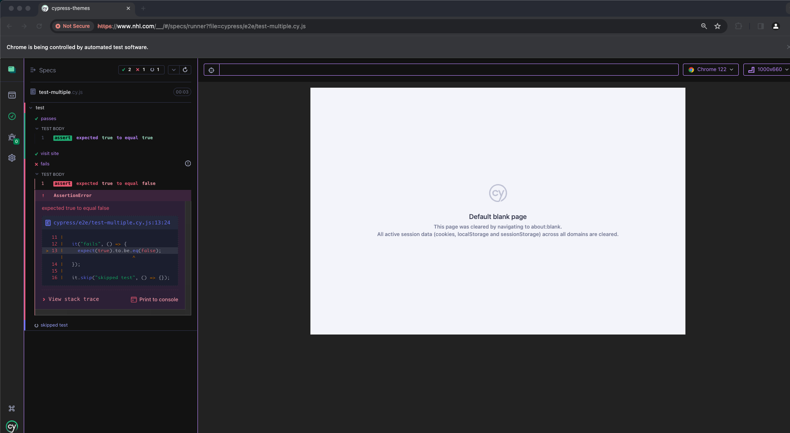
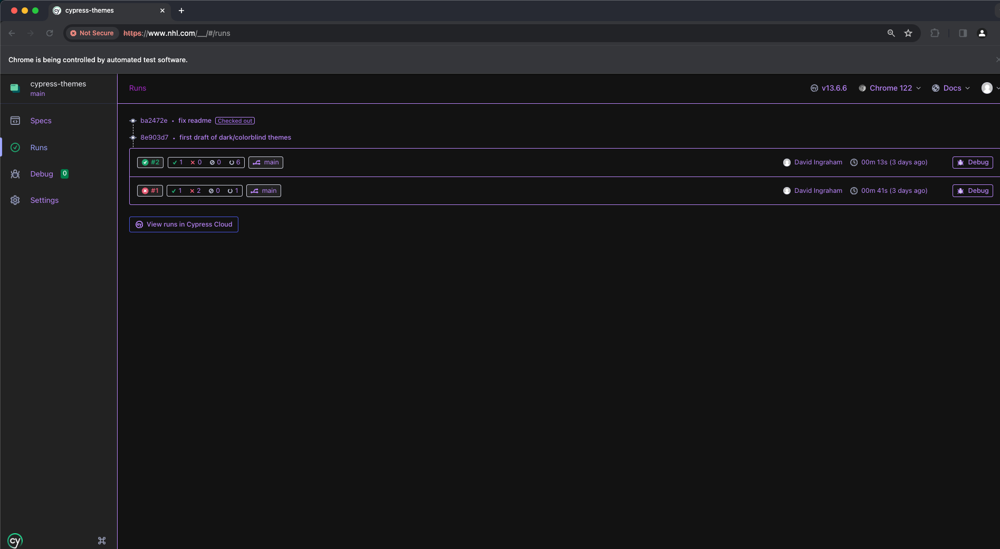
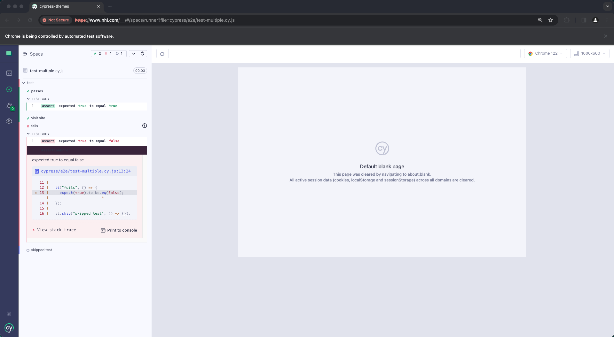
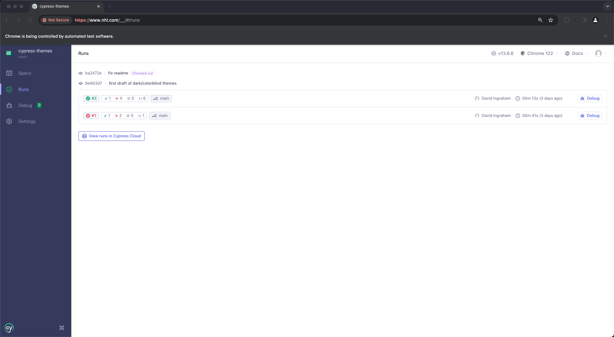
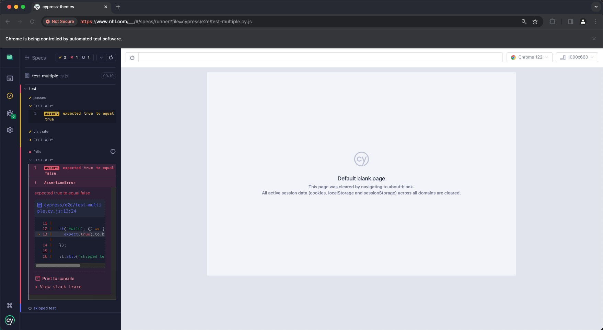
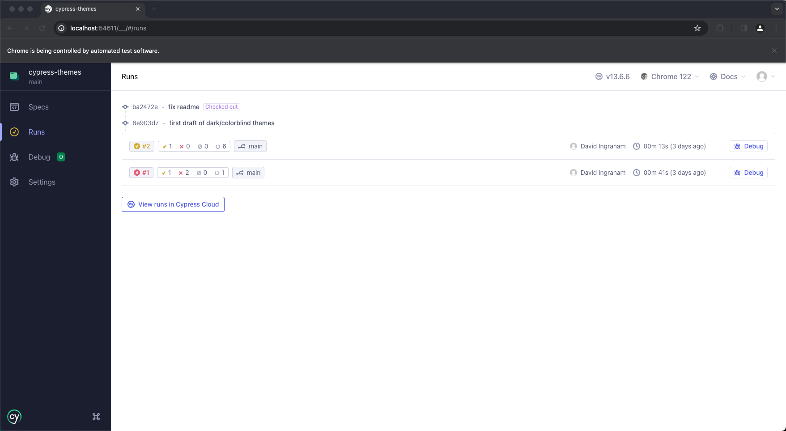

# cypress-themes

Alternative themes for the Cypress Test Runner for Cypress v10+.

Currently supports **dark-mode**, **light-mode** and **colorblind-mode**.

Heavily inspired by [cypress-dark](https://github.com/bahmutov/cypress-dark) and [cypress-light-theme](https://github.com/marktnoonan/cypress-light-theme) but all in one package.

Feel free to suggest/create additional themes.
As the test runner changes over-time, the themes may break unexpectedly. For any issues please let us know. Thanks!

## Themes

### Dark



### Light



### Colorblind



## Install
```bash
npm install --save-dev cypress-themes
```

## Use
To enable any of the themes, set the `theme` env var in your `cypress.config.js` file

The acceptable theme values are `dark`, `light`, and `colorblind`.

```json
"env": {
    "theme": "dark",
}
```

After, require the plugin in your `support/index.js` file

```javascript
require("cypress-themes");
```

## Development
For local development, install all dependencies (`npm install`) and change the `getThemesFolder` under `src/utils` to point toward the local css files.

```javascript
const getThemesFolder = () => "src/themes"; // Enable for local development
```

Next, change the `theme` env var within the `cypress.config.js` to whatever you are testing.

Finally, run the cypress test runner `npm run cy:open`

## TODO 
- [ ] Apply theme on runner load, not before a test begins
- [ ] Support cypress-plugin-api
- [ ] Remove "Colorblind" as explicit theme and allow toggle ability within runner
- [ ] Migrate over the fun Halloween mode from [cypress-dark](https://github.com/bahmutov/cypress-dark
