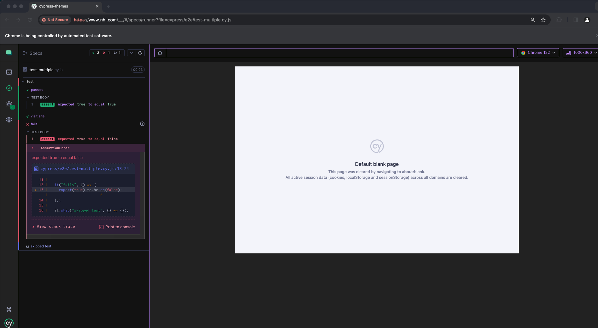
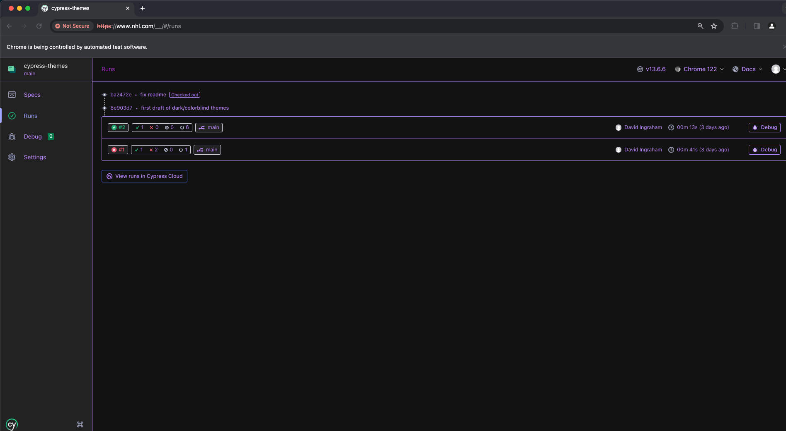
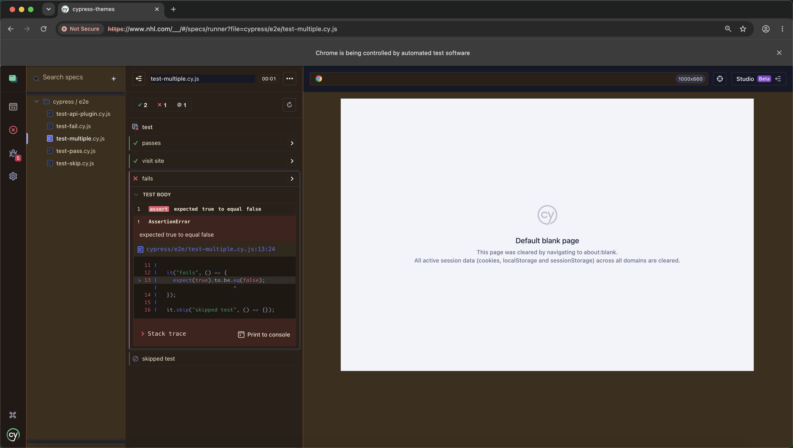
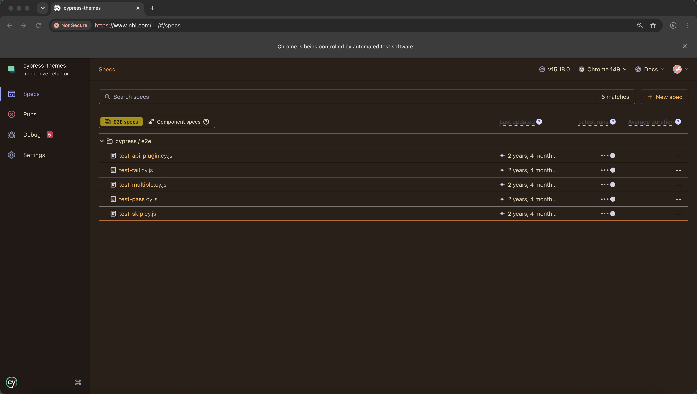
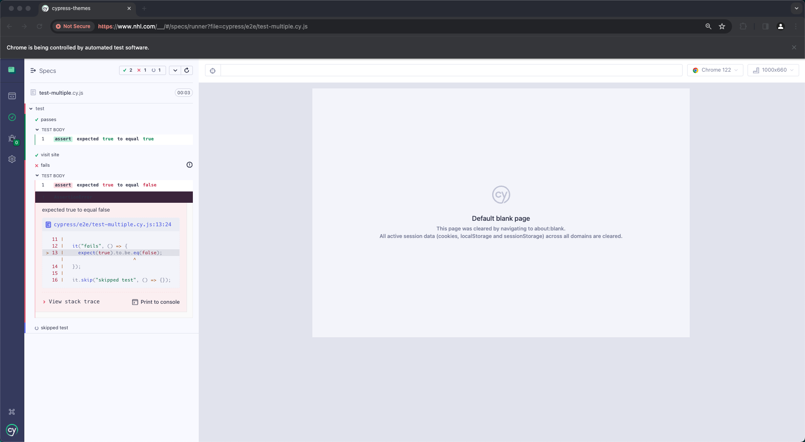
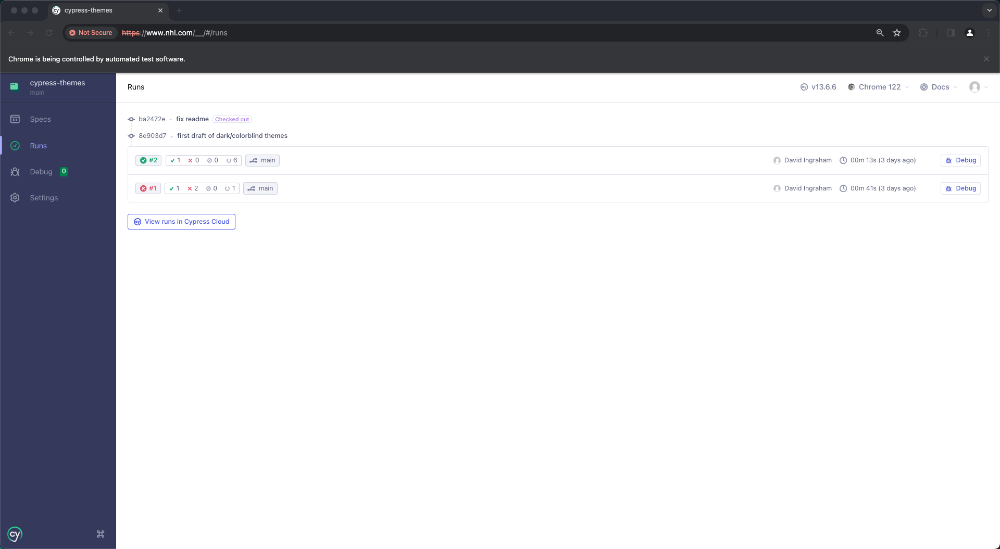
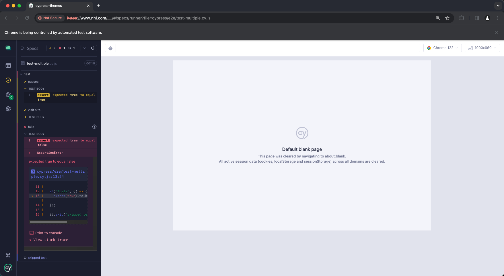
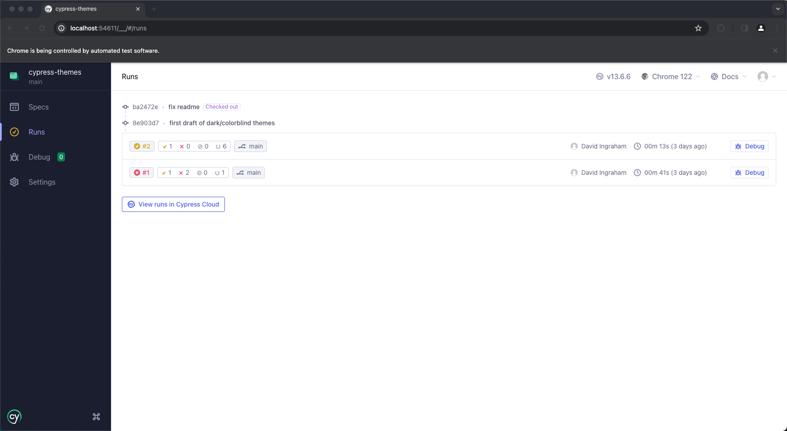

# cypress-runner-themes

Alternative themes for the Cypress Test Runner (Cypress v10+, tested on Cypress 15).

Built-in base themes: **dark**, **fall** and **light**. If no theme is set you get the
default Cypress runner. A **colorblind** modifier can be layered on top of any
base theme, and you can supply your own **custom theme** CSS.

Heavily inspired by [cypress-dark](https://github.com/bahmutov/cypress-dark) and
[cypress-light-theme](https://github.com/marktnoonan/cypress-light-theme), but all in
one package.

As the test runner changes over time, themes may break unexpectedly. If you hit an
issue please [let us know](https://github.com/dingraham/cypress-runner-themes/issues).

## Install

```bash
npm install --save-dev cypress-runner-themes
```

## Use

**1. Configure the theme** in `cypress.config.js` under the top-level `expose` block
(Cypress 15.10+):

```js
const { defineConfig } = require("cypress");

module.exports = defineConfig({
  expose: {
    theme: "dark", // "dark" | "fall" | "light"
    colorblind: false, // optional modifier, layers on any base theme
    // customTheme: "cypress/my-theme.css", // optional: your own CSS file
  },
  e2e: {
    /* ... */
  },
});
```

**2. Import the plugin** in your `cypress/support/e2e.js` file:

```javascript
import "cypress-runner-themes";
```

That's it — the theme is applied when a spec loads.

> **Legacy config:** `Cypress.env("theme")` is still supported as a fallback, but
> `Cypress.env()` is [deprecated in Cypress 15.10+](https://github.com/dingraham/cypress-runner-themes/issues/5).
> Prefer the `expose` block above. If you set both, `expose` wins.

## Themes

### Dark




### Fall




### Light




### Colorblind (Red/Green) modifier

The three main types of colour blindness are:

- Deutan (red/green)
- Protan (red/green)
- Tritan (blue/green and yellow/red)

By replacing green with yellow, Cypress test results show up as:

- Yellow (passing)
- Red (failing)
- Blue (skipped)

This addresses Deutan and Protan colour-blindness. Those with sensitivity to
red/yellow should keep the default Cypress result colours.

Enable it as a modifier on top of any base theme:

```js
expose: {
  theme: "dark",
  colorblind: true,
}
```

> Setting `theme: "colorblind"` on its own still works for backwards compatibility
> (it applies the colorblind modifier over the default runner, with no base theme).
> Note: the gold pass colour is tuned for dark reporter backgrounds — pair the
> modifier with the `dark` base (or the default runner) rather than `light`.




## Custom themes

Point `customTheme` at a CSS file in your project to use your own styles as the base
layer. The `colorblind` modifier still layers on top if enabled.

```js
expose: {
  customTheme: "cypress/my-theme.css",
  colorblind: false,
}
```

See `src/themes/*.css` for the selectors the built-in themes target.

## How it works & limitations

The plugin injects a `<style>` tag into the Test Runner's UI. Built-in themes are
bundled as strings, so they apply as soon as a spec loads — no filesystem lookup, and
it works under npm, pnpm, Yarn PnP and monorepos. Custom themes are read from disk
with `cy.readFile`, so they apply within a `before` hook.

There is no Cypress hook to theme the runner _before any spec is opened_, so the very
first paint of the app is unthemed until a spec loads.

## Development

No source edits are needed for local development — the demo project in this repo
imports the theme source directly.

1. `npm install`
2. Set the theme you want to preview in `cypress.config.js` (`expose.theme`).
3. `npm run cy:open` and open any spec in `cypress/e2e/` (there are intentionally
   passing, failing and skipped specs so you can see result colours).

If you edit any `src/themes/*.css` file, regenerate the bundled strings:

```bash
npm run build:themes
```

Formatting: `npm run format` (or `npm run format:check` in CI).

### API demo spec

`cypress/e2e/test-api-plugin.cy.js` demonstrates theming alongside
[cypress-plugin-api](https://www.npmjs.com/package/cypress-plugin-api). It calls an
external API and needs a key provided via environment variable (never commit it):

```bash
export CYPRESS_API_NINJA_API_KEY="your-key"
```

Cypress maps `CYPRESS_`-prefixed env vars to `Cypress.env("API_NINJA_API_KEY")`.

## Roadmap

- [x] Migrate config from `Cypress.env()` to `Cypress.expose()`
- [x] Colorblind as a toggle/modifier combinable with any base theme
- [x] Apply the theme on spec load rather than after the first test
- [x] Custom theme support
- [ ] Migrate the fun Halloween mode from [cypress-dark](https://github.com/bahmutov/cypress-dark)
- [ ] More built-in themes (Dracula, high-contrast, Solarized, Nord, …)
